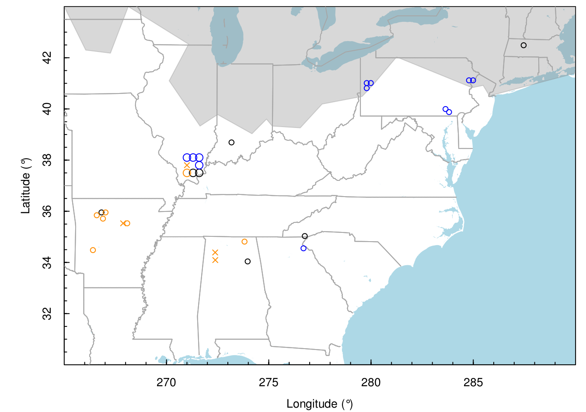
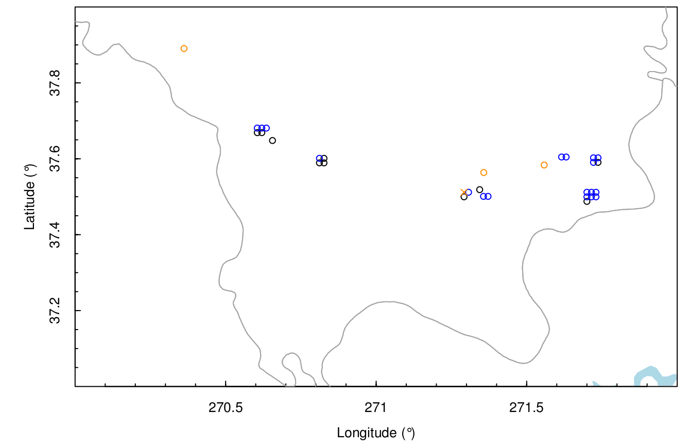
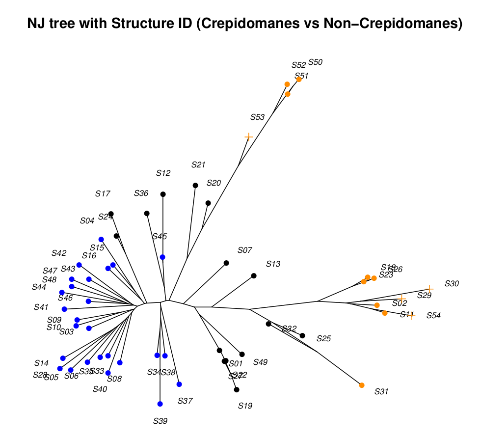
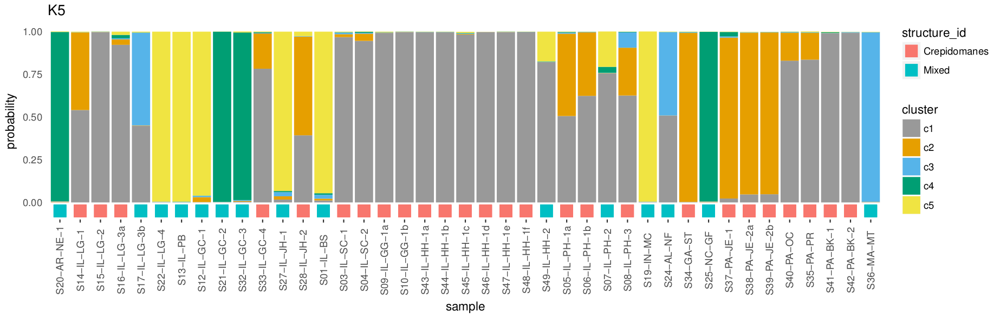
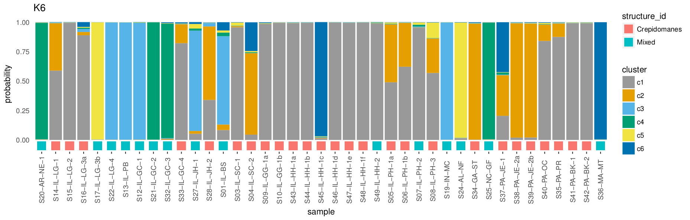
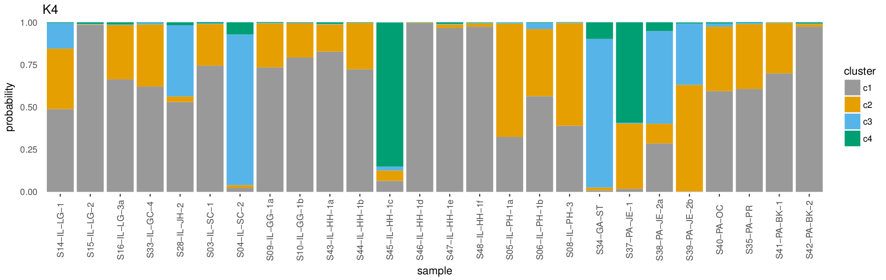
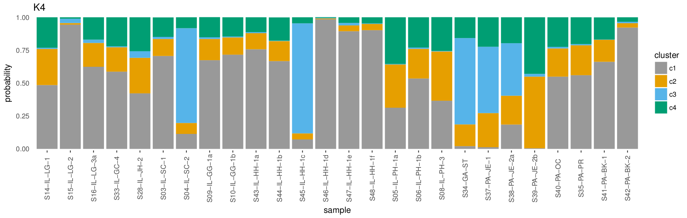
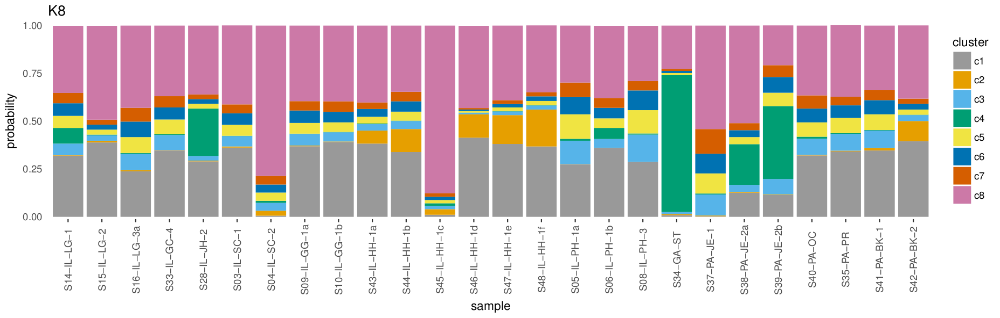
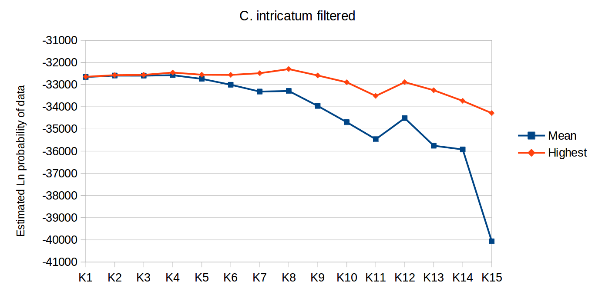

Figures
=======

__Figure 1__ - _Crepidomanes intricatum_ gametophytes. a) A small colony including gemmae at the tips of some individuals. b) A dense colony of hundreds to thousands of individuals growing in culture.

__Figure 2__ - Mean clusters per sample for _Vandenboschiana boschiana_ sporophytes and gametophytes at a range of cluster threshold values.

__Figure XX__ - Locations and species suspected by collector of _Crepidomanes intricatum_, _Didymoglossum petersii_, and _Vandenboschia boschiana_ samples.

__Figure XX__ - Locations and species assigned based on this study of _Crepidomanes intricatum_, _Didymoglossum petersii_, _Vandenboschia boschiana_, and mixed/unknown samples.

__Figure XX__ - Probabilites of assignment to the cluster without gametophytes in Structure runs using the All-33, All-50, and All-66 datasets. "Suspected spp" is the species the collector of the samples assumed based on geographic location and presence/absence of nearby sporophytes. "Assigned spp" is the species assignment for this study based on the Structure results. Error bars show the combined confidence intervals from all three runs.

__Figure XX__ - Neighbor-joining Euclidean distance trees using the All-33 dataset. Tip labels are colored based on Structure results.

__Figure XX__ - Results of Structure analyses for the datasets including samples assigned as _C. intricatum_ or mixed/unknown, with and without non-_Crepidomanes_ loci. Results shown are from the best of 10 runs using the optimal number of clusters for each dataset.

__Figure XX__ - Results of Structure analyses for the datasets including only samples assigned as _C. intricatum_, with and without non-_Crepidomanes_ loci. Results shown are from the best of 10 runs using the optimal number of clusters for each dataset.

__Figure XX__ - K-means analysis of subset of the data with only _C. intricatum_ samples and with non-_Crepidomanes_ loci removed. 20 replicate Structure runs with number of clusters (K) ranging from 1 to 15.

  
