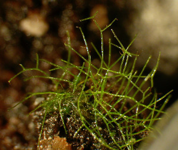
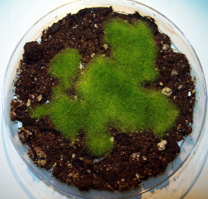
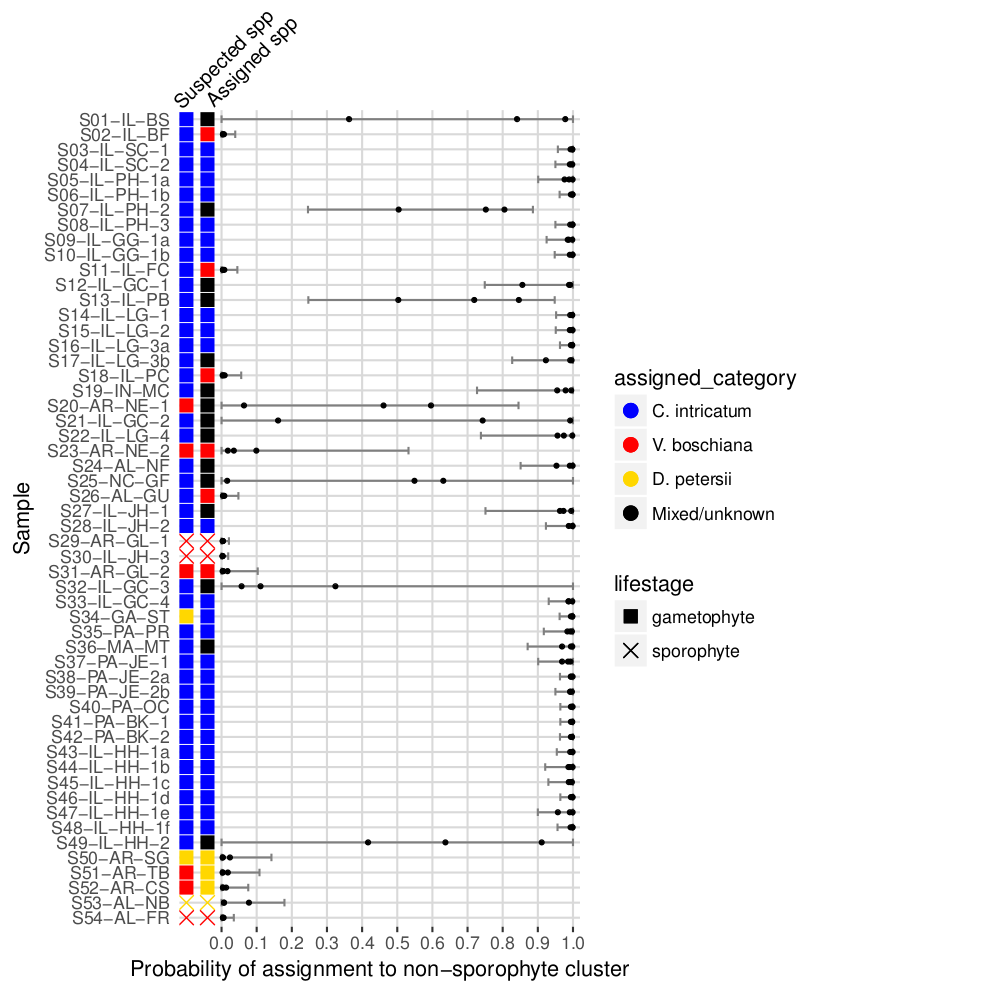

Figures
=======

__Figure 1__ - _Crepidomanes intricatum_ gametophytes. a) A small colony including gemmae at the tips of some individuals. b) A dense colony of hundreds to thousands of individuals growing in culture.

__Figure 2__ - Mean clusters per sample for _Vandenboschiana boschiana_ sporophytes and gametophytes at a range of cluster threshold values.

__Figure XX__ - Locations and species suspected by collector of _Crepidomanes intricatum_, _Didymoglossum petersii_, and _Vandenboschia boschiana_ samples.

__Figure XX__ - Locations and species assigned based on this study of _Crepidomanes intricatum_, _Didymoglossum petersii_, _Vandenboschia boschiana_, and potentially mixed samples.

__Figure XX - Probabilites of assignment to the cluster without gametophytes in Structure runs using the All-33, All-50, and All-66 datasets. "Suspected spp" is the species the collector of the samples assumed based on geographic location and presence/absence of nearby sporophytes. "Assigned spp" is the species assignment for this study based on the Structure results. Error bars show the combined confidence intervals from all three runs.

