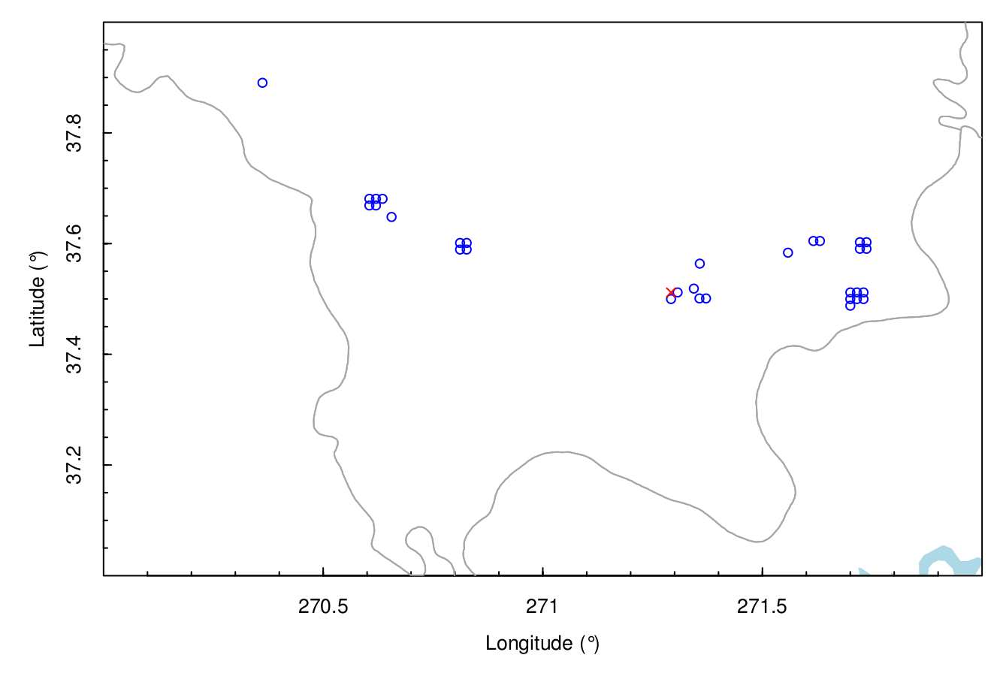
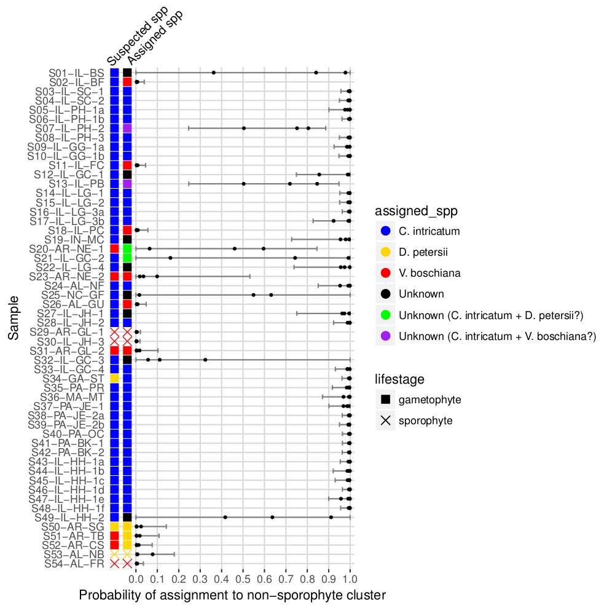

Figures
=======

__Figure 1__ - _Crepidomanes intricatum_ gametophytes. a) A small colony including gemmae at the tips of some individuals. b) A dense colony of hundreds to thousands of individuals growing in culture.

__Figure 2__ - Mean clusters per sample for _Vandenboschiana boschiana_ sporophytes and gametophytes at a range of cluster threshold values.

__Figure 3__ - Locations and species suspected by collector of _Crepidomanes intricatum_, _Didymoglossum petersii_, and _Vandenboschia boschiana_ samples.

__Figure 4__ - Locations and species assigned based on this study of _Crepidomanes intricatum_, _Didymoglossum petersii_, _Vandenboschia boschiana_, and mixed/unknown samples.

__Figure 5__ - Probabilites of assignment to the cluster without gametophytes in Structure runs using the All-33, All-50, and All-66 datasets. "Suspected spp" is the species the collector of the samples assumed based on geographic location and presence/absence of nearby sporophytes. "Assigned spp" is the species assignment for this study based on the Structure results. Error bars show the combined confidence intervals for all three datasets.

__Figure 6__ - Neighbor-joining Euclidean distance trees using the All-33 dataset. Tip labels are colored based on Structure results. Nodes labeled with numbers indicated bootstrap values >50.

__Figure 7__ - Results of Structure analyses for the datasets including samples assigned as _C. intricatum_ or mixed/unknown, a) with and b) without non-_Crepidomanes_ loci. Results shown are from the best of 20 runs at K=2.

__Figure 8__ - Results of Structure analyses for the subset of the data including only samples assigned as _C. intricatum_. Results shown are from the best of 20 runs at K=2.

__Figure 9__ - K-means analysis for the datasets including samples assigned as _C. intricatum_ or _C. intricatum_ + Unknown, with and without non-_Crepidomanes_ loci.

__Figure 11__ - Delta-K analysis for all four datasets.

__Figure 12__ - Neighbor-joining Euclidean distance tree for _C. intricatum_ samples.

__Figure 13__ - Minimum spanning network for _C. intricatum_ samples.

__Figure 14__ - Pairwise comparisons of genetic distance vs. geographic distance in _C. intricatum_ samples.

__Figure 15__ - Genetic distance between _C. intricatum_ samples at different geographic scales. Within collection = growing within approximately 10 cm of each other. Within site = different collections within approximately 100 meters. Within region = different sites within 100 km. Between regions = over 100 km apart.

__Figure 16__ - Comparisons of distribution of pairwise distances of within-collection samples and non-within-collection samples in a) the original GBS dataset and b) a GBS dataset generated by replacing within-collection samples with resampled simulated clones. The density curve describes the distribution of pairwise distances of the non-within-collection samples and the vertical lines indicate the pairwise distances of within-collection samples or simulated clones. Red=S05--S06, Green=S09--S10, Blue=S16--S17, Cyan=S38--S39, Magenta=S43--S44--S46--S47--S48.  

