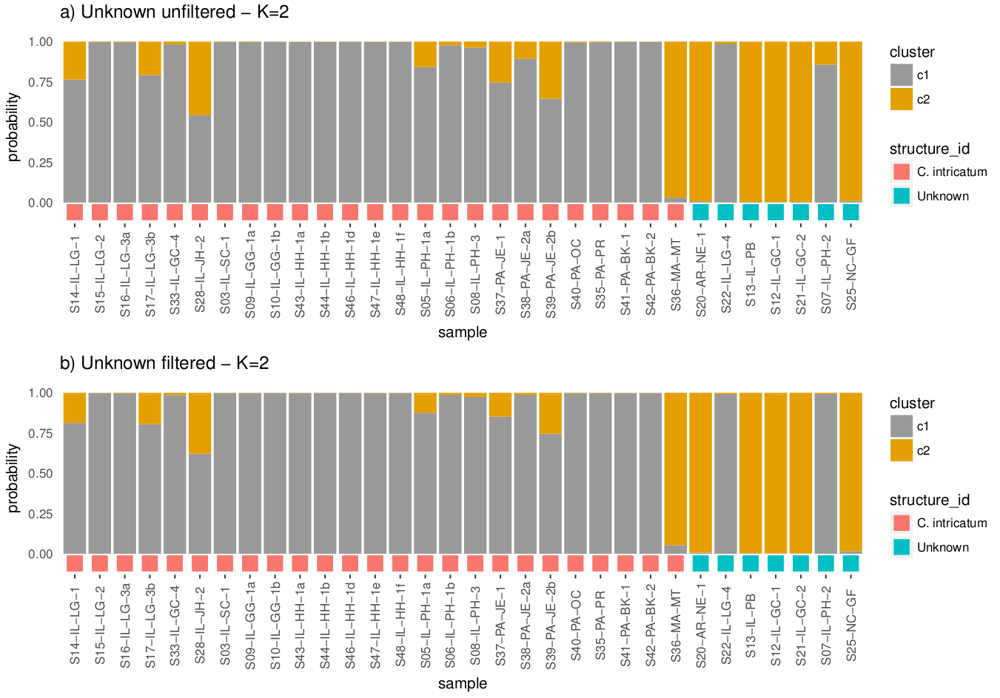
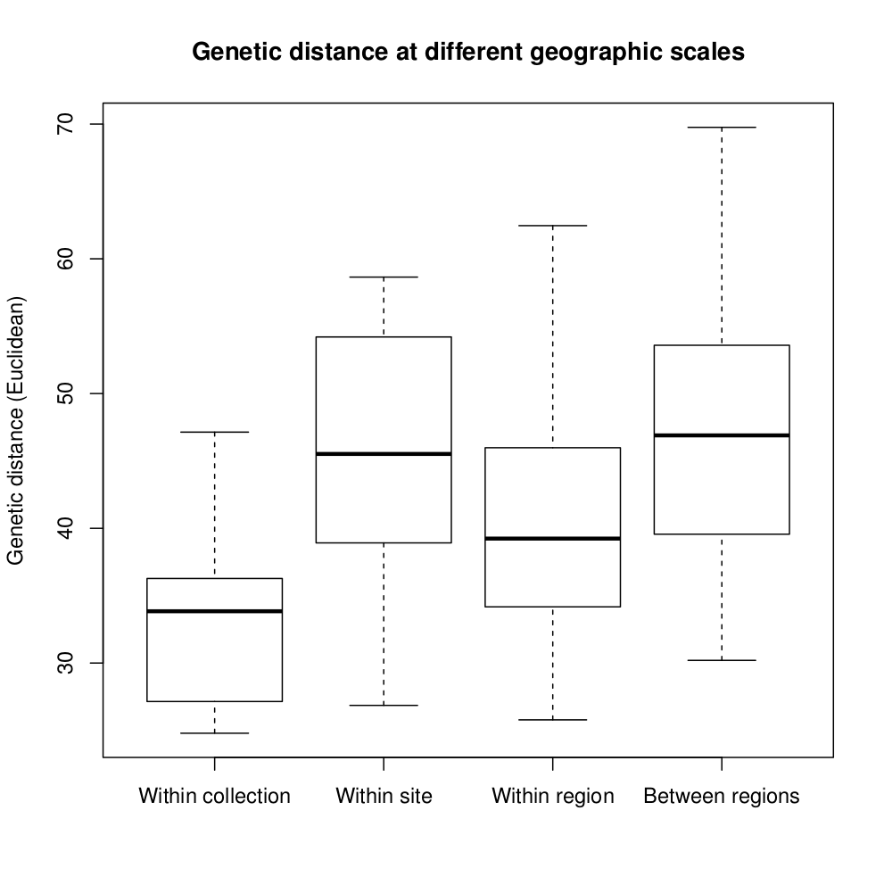
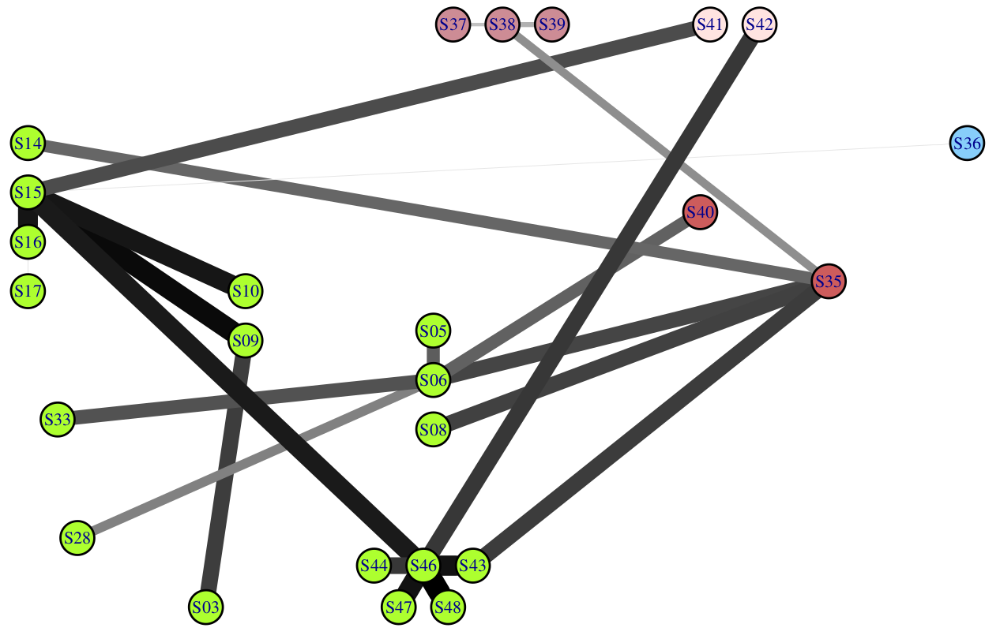

Figures
=======

__Figure 1__ - _Crepidomanes intricatum_ gametophytes. a) A small colony including gemmae at the tips of some individuals. b) A dense colony of hundreds to thousands of individuals growing in culture.

__Figure 3__ - Locations and species assigned based on this study of _Crepidomanes intricatum_ (blue), _Didymoglossum petersii_ (yellow), _Vandenboschia boschiana_ (red), and Unknown samples (green=possible _C. intricatum_ + _D. petersii_, violet=possible _C. intricatum_ + _V. boschiana_, black=unknown).

__Figure 4__ - Mean clusters per sample for _Vandenboschiana boschiana_ sporophytes and gametophytes at a range of cluster threshold values.

__Figure 5__ - Probabilites of assignment to the cluster without sporophytes in Structure runs using the All-33, All-50, and All-66 datasets. "Suspected spp" is the species assumed by the collector of the sample based on geographic location and observed presence/absence of sporophytes. "Assigned spp" is the species assignment for this study based on the Structure results. Error bars show the combined extents of the confidence intervals for all three datasets.

__Figure 6__ - Neighbor-joining Euclidean distance trees using the All-33 dataset. Tip labels are colored based on Structure results. Nodes with numbers indicate bootstrap values >50.

__Figure 7__ - Mean estimated log probability of data for Structure runs at a range of K values using the datasets including samples assigned as _C. intricatum_ or _C. intricatum_ + Unknown, with and without loci shared with _D. petersii_ or _V. boschiana_ samples.

__Figure 8__ - Evanno Delta-K values for Structure runs at a range of K values using the datasets including samples assigned as _C. intricatum_ or _C. intricatum_ + Unknown, with and without loci shared with _D. petersii_ or _V. boschiana_ samples.

__Figure 9__ - Results of Structure analyses for the datasets including samples assigned as _C. intricatum_ or Unknown, a) with and b) without loci shared with _D. petersii_ or _V. boschiana_ samples. Results shown are from the best of 20 runs at K=2.

__Figure 10__ - Results of Structure analyses for the dataset including only samples assigned as _C. intricatum_. Results shown are from the best of 20 runs at K=2.

__Figure 11__ - Pairwise comparisons of genetic distance vs. geographic distance in _C. intricatum_ samples.

__Figure 12__ - Genetic distance between _C. intricatum_ samples at different geographic scales. Within collection = growing within approximately 10 cm of each other. Within site = different collections within approximately 100 meters. Within region = different sites within 100 km. Between regions = over 100 km apart.

__Figure 13__ - Neighbor-joining Euclidean distance tree for _C. intricatum_ samples. Tip labels are colored based on geographic region. Nodes with numbers indicate bootstrap values >50.

__Figure 14__ - Minimum spanning network for _C. intricatum_ samples. Nodes are colored based on geographic region and node positions are suggestive of the relative positions of collection sites within each region. Thicker/darker lines represent smaller pairwise genetic distances.

__Figure 15__ - Distribution of pairwise distances of within-collection samples and non-within-collection samples in a) the original GBS dataset and b) a GBS dataset generated after replacing within-collection samples with resampled, simulated clones. The density curve describes the distribution of pairwise distances of all 25 samples and the vertical lines indicate the pairwise distances of within-collection samples or simulated clones. Red=S05--S06, green=S09--S10, blue=S16--S17, cyan=S38--S39, orange=S43--S44--S46--S47--S48.

__Figure 16__ - Distribution of pairwise genetic distances for 25 _C. intricatum_ samples. Three overlapping histograms represent pairwise comparisons between any two of the eight most genetically similar samples (blue), comparisons between the four most genetically distant samples and all other samples (red), and all other pairwise comparisons (black).

